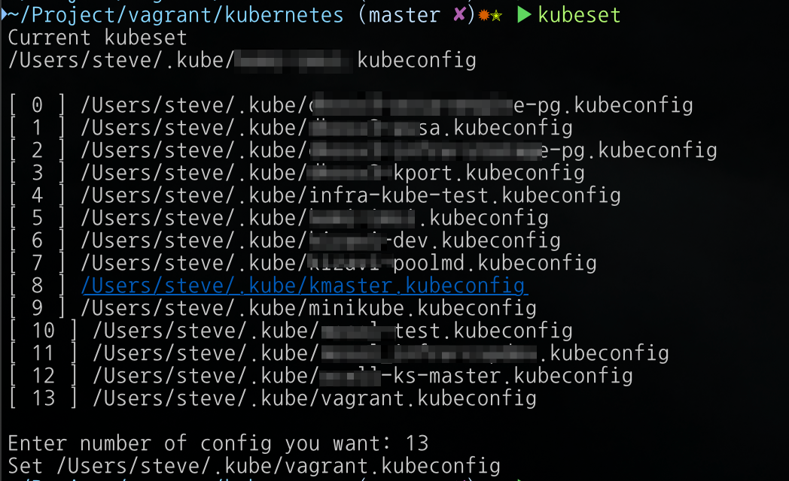

kubeset
===

동일한 User name을 사용하는 다양한 Kubernetes Cluster를 사용하는데 어려움이 있어 개발한 bash script입니다.  
여러 클러스터를 동시에 운영해야 한다면 kubeconfig 파일을 깨끗하게 보관하고 바꿔가며 운영 할 수 있다.  


# 사용법
* ${HOME}/.kube/config 백업 후 삭제
* ${HOME}/.kube 폴더 아래 멀티 클러스터 환경 kubeconfig 파일을 {임의의 이름}.kubeconfig 확장자로 저장됩니다.


# 설명
* .kubeconfig 파일 중 선택된 파일을 .kube/config 파일로 link를 걸어주는 방법입니다
* kubeset 파일을 실행 폴더에 넣고 kubeset 명령을 넣으면 변경 할 kubeconfig 메뉴를 보여줍니다.
* 메뉴의 숫자를 입력하면 kubectl 명령을 통해 클러스터를 관리 할 수 있습니다.


# Change Log
* first commit
* add SHELL command at the last line to enter new console
* change logic to make config from env
  

---
Kubeset
===
A bash script developed because of the difficulty of using various Kubernetes Clusters that use the same User name.  
If you need to run multiple clusters at the same time, kubeconfig files can be kept clean, changed, and operated.  
  
  
# Usage
* The simple way that it makes symbolic link .kube/config from one of .kubeconfig files
* Type kubeset in command prompt. it makes a menu with kubeconfig files
  
  
  


---
kalias
===
`.kube/*.kubeconfig` 파일에 대한 단축어 alias 만들어주는 스크립트입니다.
```bash
alias acs='kubecolor --kubeconfig=/Users/steve/.kube/dkosv3-assa-cbt.kubeconfig'
alias wacs='watch kubectl --kubeconfig=/Users/steve/.kube/dkosv3-assa-cbt.kubeconfig'

alias oap='kubecolor --kubeconfig=/Users/steve/.kube/dkosv3-oapiv4.kubeconfig'
alias woap='watch kubectl --kubeconfig=/Users/steve/.kube/dkosv3-oapiv4.kubeconfig'
```
${HOME}/.kalias 파일로 kubeconfig 파일의 단축 alias 파일을 생성해줍니다.  
kubecolor 및 kubectl 명령어가 사전에 설치되어 있어야 정상 작동됩니다. kubecolor를 사용하지 않으시면 kubectl로 스크립트 수정하시면됩니다.  
alias 이름은 세 글자 이상으로 서로 겹치지 않도록 생성됩니다. 각 alias 앞에 `w{alias}`는 지속적인 모니터링을 위한 watch 명령어가 추가된 alias입니다.  

## 사용법
- ./kalias.sh 실행
- ${HOME}/.kalias 파일 생성
- ${HOME}/.bashrc or ${HOME}/.zshrc 에서 source ${HOME}/.kalias 실행 또는 .bashrc나 .zshrc에 source ${HOME}/.kalias 추가
- kal 명령어로 alias 목록 확인


## kal 함수등록
kalias로 생성된 목록을 확인 할 수 있도록 .bashrc 또는 .zshrc에 아래 함수 등록해줍니다.
```bash
## for kalias
source ${HOME}/.kalias
function kal() {
	while IFS=" " read -r _ alias_command; do
	    alias_name=$(echo "$alias_command"| cut -d'=' -f1)
		config_file=$(echo "$alias_command" | cut -d'=' -f3 | tr -d "'")
		config_name=$(basename "$config_file" .kubeconfig)
		echo "$alias_name $config_name"
    done < "${HOME}/.kalias"
}
```
